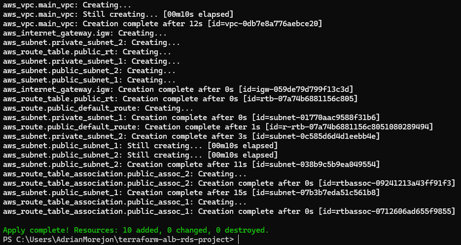
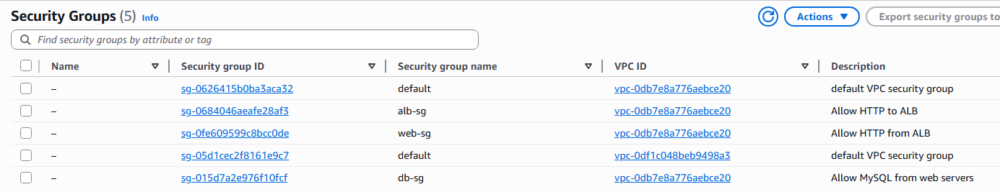
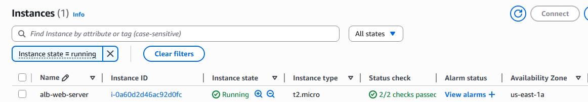
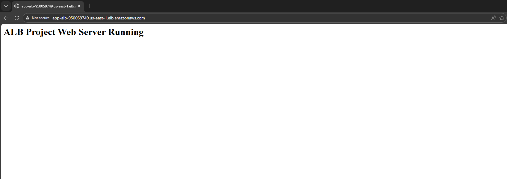

## Overview

This project demonstrates a highly available AWS web application architecture using Terraform.

The environment includes an Application Load Balancer distributing traffic to an Auto Scaling group of EC2 instances running in private subnets, with a backend RDS database for persistent storage.

The goal of the project was to practice designing a scalable and layered cloud architecture while implementing infrastructure as code.

## Architecture

```
                Internet
                    │
                    ▼
         Application Load Balancer
                    │
                    ▼
            EC2 Application Tier
            (Auto Scaling Group)
                    │
                    ▼
               RDS Database
             (Private Subnets)

Network Design
Public Subnets → ALB
Private App Subnets → EC2
Private DB Subnets → RDS
```

## Infrastructure Components

• Custom VPC with public and private subnets  
• Application Load Balancer for incoming traffic  
• Auto Scaling EC2 application tier  
• Private RDS database tier  
• Security groups enforcing least privilege access  
• Route tables and NAT gateway for controlled outbound traffic  

## Security Considerations

• Application instances run in private subnets  
• Database tier isolated in separate private subnets  
• Security groups restrict communication between tiers  
• Only the ALB is exposed to the internet  

## Screenshots

### Terraform Infrastructure Deployment


### VPC Architecture


### Security Groups


### EC2 Application Server


### Application Load Balancer Routing Traffic


### RDS Database Endpoint

